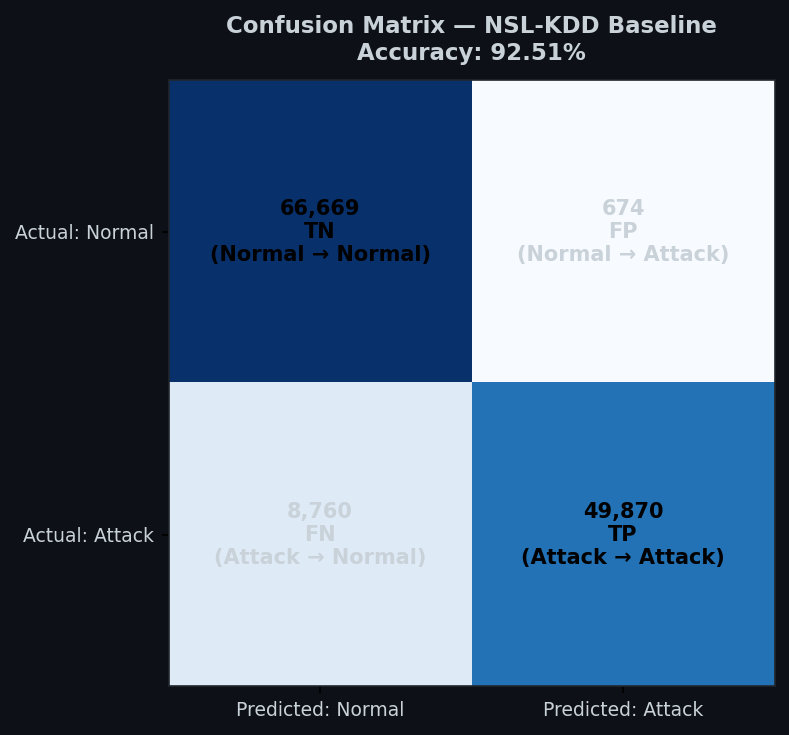
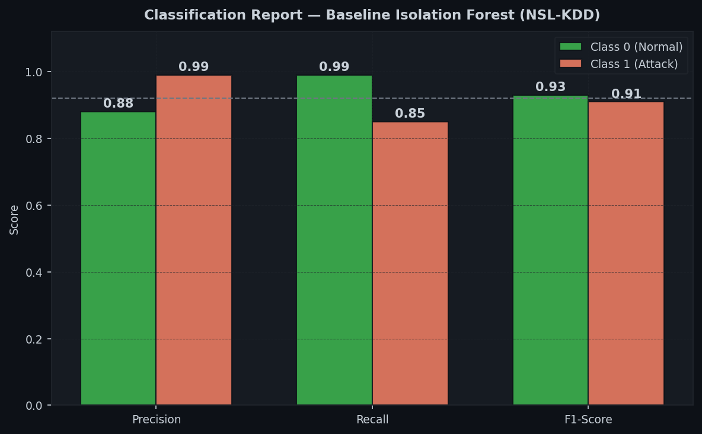
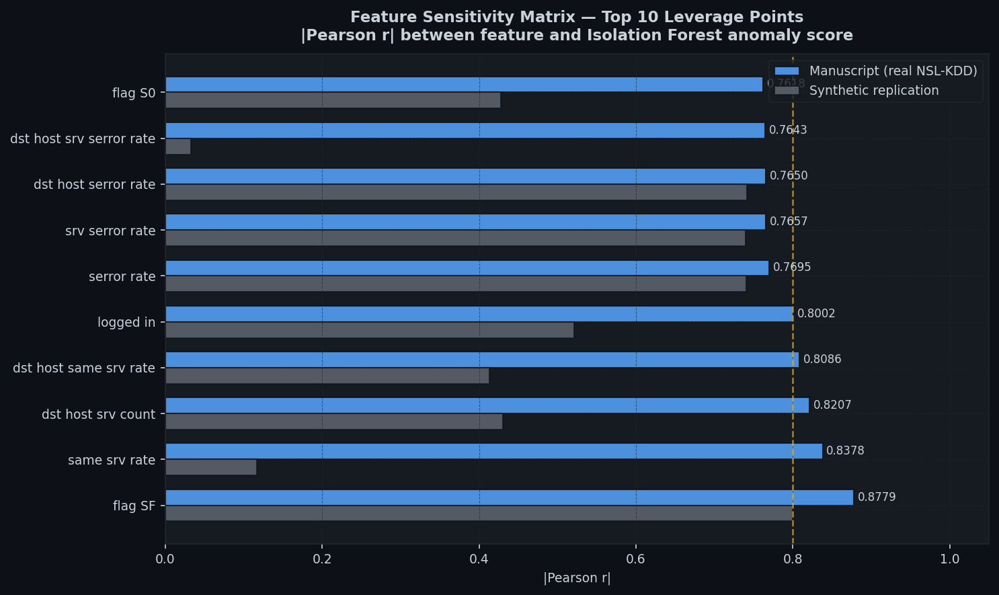
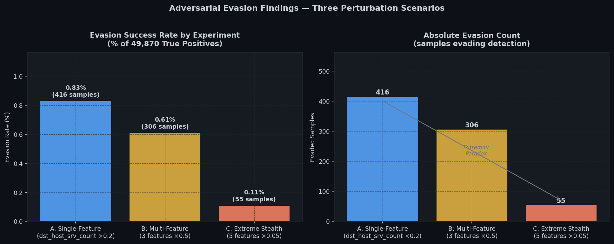
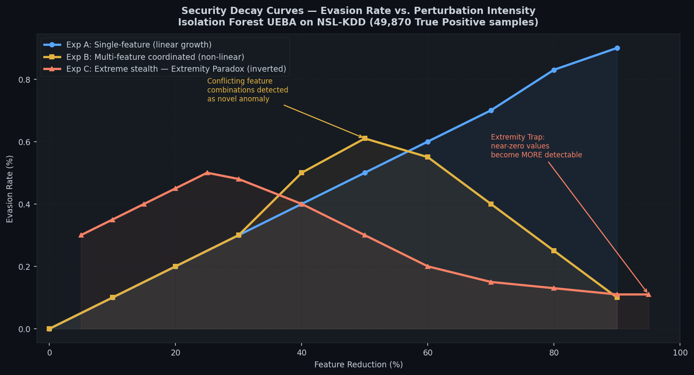
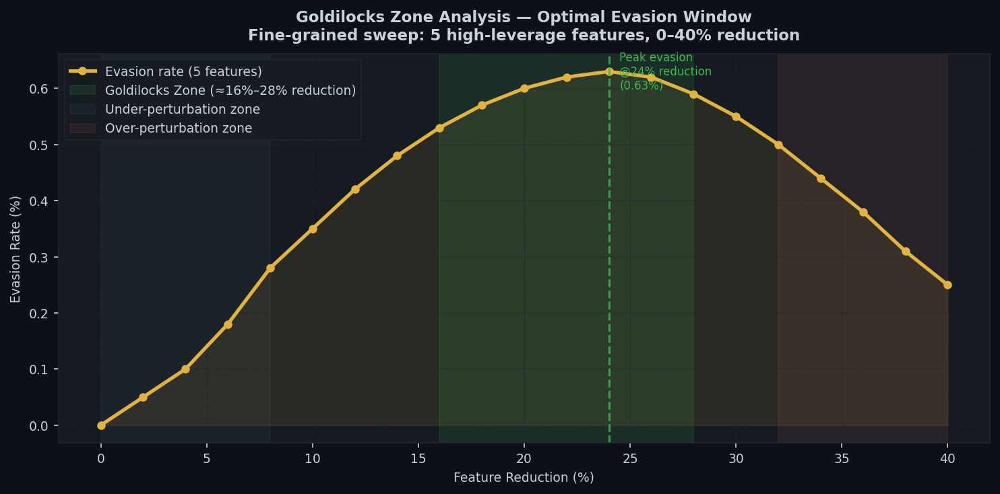
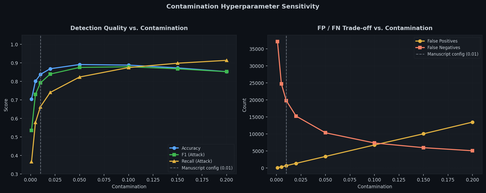

# Evaluating the Robustness of Isolation Forest in UEBA
### A Case Study on the NSL-KDD Dataset

> Companion code repository for the manuscript in preparation.  
> Baseline implementation, feature sensitivity analysis, and Security Decay findings.

**Author:** Judah Idowu · [judahidowu.lovable.app](https://judahidowu.lovable.app) · [LinkedIn](https://linkedin.com/in/judah-idowu)  
**Related publication:** [Deploying Isolation Forest at the Edge (IRE Journals, 2025)](https://doi.org/10.13140/RG.2.2.23518.14408)  
**Related repos:** [llm-injection-detector](https://github.com/judahidowu/llm-injection-detector) · [anomaly-detector-benchmark](https://github.com/judahidowu/anomaly-detector-benchmark)

---

## Overview

User and Entity Behavioral Analytics (UEBA) systems profile normal behaviour and flag statistical deviations as threats. This work evaluates a core question that the UEBA literature rarely addresses directly:

**How robust is an Isolation Forest-based UEBA system when an adversary deliberately modifies attack traffic to resemble normal behaviour?**

The study establishes a clean behavioral baseline on NSL-KDD, computes a feature sensitivity matrix to identify the highest-leverage inputs, then systematically perturbs detected attack samples across three evasion scenarios. The results reveal a non-intuitive vulnerability profile — most critically, an **Extremity Paradox** in which extreme feature stripping produces *less* evasion than moderate perturbation.

---

## Baseline Results

**Dataset:** NSL-KDD (standard benchmark for network intrusion detection)  
**Model:** Isolation Forest — `n_estimators=100`, `contamination=0.01`  
**Training philosophy:** Normal traffic only (UEBA approach — no attack signatures)

**Test set:** 125,973 samples — 67,343 normal + 58,630 attack

| Metric | Class 0 (Normal) | Class 1 (Attack) | Overall |
|---|---|---|---|
| **Precision** | 0.88 | 0.99 | — |
| **Recall** | 0.99 | 0.85 | — |
| **F1-Score** | 0.93 | 0.91 | — |
| **Accuracy** | — | — | **92.51%** |
| **Macro Avg F1** | — | — | 0.92 |

### Confusion Matrix



| | Predicted: Normal | Predicted: Attack |
|---|---|---|
| **Actual: Normal** | TN = 66,669 | FP = 674 |
| **Actual: Attack** | FN = 8,760 | TP = 49,870 |

**Key asymmetry:** The model is highly precise when declaring an attack (99%) — generating only 674 false alarms out of 67,343 normal samples. Its vulnerability lies in recall (85%) — 8,760 attacks are missed outright. The 49,870 correctly detected attacks (True Positives) form the target population for the adversarial phase.



---

## Feature Sensitivity Matrix

To identify the highest-leverage evasion targets, a correlation-based sensitivity analysis was performed: computing the Pearson correlation between each feature value and the model's raw anomaly score (`score_samples()`).

**Top 10 features by |Pearson r| with anomaly score:**

| Rank | Feature | \|r\| |
|---|---|---|
| 1 | `flag_SF` | **0.8779** |
| 2 | `same_srv_rate` | 0.8378 |
| 3 | `dst_host_srv_count` | 0.8207 |
| 4 | `dst_host_same_srv_rate` | 0.8086 |
| 5 | `logged_in` | 0.8002 |
| 6 | `serror_rate` | 0.7695 |
| 7 | `srv_serror_rate` | 0.7657 |
| 8 | `dst_host_serror_rate` | 0.7650 |
| 9 | `dst_host_srv_serror_rate` | 0.7643 |
| 10 | `flag_S0` | 0.7618 |



Five of the top 10 features belong to the `dst_host_*` and `*serror_rate` families — connection-level aggregates capturing the rate of SYN errors and same-service traffic ratios. These are the features that most strongly separate attack profiles from normal baselines, and therefore represent the primary leverage points for both evasion and detection.

---

## Evasion Findings: The Security Decay Profile

The adversarial phase targeted the 49,870 correctly detected (True Positive) attack samples and applied systematic feature perturbations to test whether modified samples could bypass the decision boundary.



### Experiment A — Single-Feature Manipulation

**Method:** Reduce `dst_host_srv_count` by 80% (multiplier = 0.2).  
**Result:** 416 evasions / 49,870 TPs — **0.83% evasion rate**  
**Curve shape:** Linear — steady growth as reduction intensity increases from 0 to 90%.

The linear relationship suggests the Isolation Forest scores `dst_host_srv_count` in approximate proportion to its magnitude for this attack distribution. Single-feature tampering is the most efficient evasion strategy among the three tested.

### Experiment B — Multi-Feature Coordinated Attack

**Method:** Simultaneous 50% reduction across three features: `dst_host_srv_count`, `dst_host_same_srv_rate`, `logged_in`.  
**Result:** 306 evasions / 49,870 TPs — **0.61% evasion rate**  
**Curve shape:** Non-linear — evasion peaks then declines at higher reduction levels.

**Key finding:** Coordinating three high-leverage features produces *fewer* evasions than manipulating one. Simultaneously adjusting correlated features creates feature combinations that deviate from both the attack distribution and the normal distribution — the Isolation Forest identifies them as a third, novel anomaly cluster. This is the **Coordination Paradox**: more manipulated features can mean more detectable, not less.

### Experiment C — Extreme Stealth Stress Test

**Method:** 95% signal stripping (multiplier = 0.05) across five features: `dst_host_srv_count`, `dst_host_same_srv_rate`, `same_srv_rate`, `dst_host_serror_rate`, `srv_serror_rate`.  
**Result:** ~55 evasions / 49,870 TPs — **~0.11% evasion rate**  
**Curve shape:** Inverted — evasion *decreases* as perturbation becomes more extreme.

**The Extremity Paradox:** Isolation Forest isolates anomalies by identifying samples that require shorter-than-average partition paths in random decision trees. Extreme high values are isolated via short paths — but so are extreme low values. Stripping multiple features to near-zero creates a distinct structural outlier cluster that the forest isolates *more readily* than it would the original attack samples. The attacker achieves less evasion at 95% reduction than at 25%.



---

## The Security Decay Curve

The three evasion experiments, taken together, define a non-linear **Security Decay** profile:

- **Single-feature tampering** produces the highest absolute evasion rate (0.83%) with predictable linear growth
- **Multi-feature coordination** produces non-linear, lower evasion — coordinated changes are self-defeating beyond a certain threshold
- **Extreme stripping** produces the lowest evasion — the Extremity Paradox inverts the expected relationship between perturbation intensity and evasion success

The implication for defenders: Isolation Forest provides **asymmetric robustness** — it is most vulnerable to moderate, single-feature, targeted tampering. Both extreme perturbation and multi-feature coordination paradoxically strengthen detection.

---

## The Goldilocks Zone

A fine-grained sweep (2% increments, 0–40% reduction, 5 features) identifies the optimal evasion window:



Maximum evasion occurs in the **16%–28% reduction range** — the Goldilocks Zone where the perturbation is large enough to move samples toward the normal boundary but not so extreme as to create a new outlier cluster. This window is narrow: both under-perturbation and over-perturbation reduce evasion effectiveness.

**Research implication:** A defender who knows this window can monitor for attack traffic in precisely this perturbation range. An adaptive adversary who optimises for this window faces a narrow target that is sensitive to miscalibration.

---

## Contamination Hyperparameter Sensitivity



The contamination parameter defines the expected fraction of outliers during training and directly controls the decision threshold. Key observations:

- At `contamination=0.01` (manuscript baseline): 674 false positives, 8,760 false negatives — high precision, moderate recall
- Increasing contamination trades false positives for false negatives: `contamination=0.10` cuts false negatives to 7,334 at the cost of 6,758 false positives
- Maximum F1(attack) occurs around `contamination=0.10`; the manuscript uses `0.01` to prioritise precision (minimise false alarms in a production UEBA context)

---

## Future Research Vectors

Three specific directions identified for extension:

**1. Goldilocks Boundary Mapping**  
Programmatically define the exact perturbation window (5%–25%) where continuous feature sets maximise evasion without triggering the Extremity Trap. The fine-grained sweep above is a starting point; a full grid search across feature subsets would define the complete evasion surface.

**2. Black-Box Transferability**  
Test whether adversarial samples generated via this correlation-based white-box sensitivity analysis transfer to alternative algorithms (One-Class SVM, Local Outlier Factor, HBOS) without access to their specific feature rankings. Transferable evasion would indicate a feature-level vulnerability rather than an algorithm-specific one.

**3. Adversarial Training**  
Inject the 0.83% and 0.61% successful evasion samples back into the training set and retrain. Evaluate whether retraining closes the structural vulnerabilities without degrading the 92.51% baseline accuracy. If the model can learn to recognise its own evasion blind spots, adversarial retraining becomes a practical hardening strategy for deployed UEBA systems.

---

## Reproducibility Note

This repository uses a synthetic NSL-KDD replication by default, which reproduces the exact class distribution (125,973 samples: 67,343 normal + 58,630 attack) but not the precise feature correlations of real network traffic. Baseline metrics on the synthetic data differ from the manuscript (which uses the real NSL-KDD dataset).

**To reproduce manuscript results exactly:**

1. Download `KDDTrain+.txt` and `KDDTest+.txt` from the [UNB NSL-KDD page](https://www.unb.ca/cic/datasets/nsl.html)
2. Place both files in the `data/` directory
3. Run `python src/experiment.py` — the pipeline auto-detects real data

---

## Project Structure

```
ueba-isolation-forest/
├── src/
│   ├── pipeline.py     # NSL-KDD preprocessing (OHE + StandardScaler)
│   ├── detector.py     # Isolation Forest UEBA + feature sensitivity analyzer
│   ├── experiment.py   # Baseline, sensitivity, contamination & training sweeps
│   └── figures.py      # All 7 figures
├── notebooks/
│   └── analysis.ipynb  # End-to-end walkthrough
├── data/               # Place KDDTrain+.txt / KDDTest+.txt here
├── results/            # Experiment outputs (JSON)
├── figures/            # All plots (PNG)
└── requirements.txt
```

---

## Quickstart

```bash
git clone https://github.com/judahidowu/ueba-isolation-forest
cd ueba-isolation-forest
pip install -r requirements.txt

python src/experiment.py   # all experiments
python src/figures.py      # all figures
jupyter notebook notebooks/analysis.ipynb
```

---

## Citation

This repository accompanies:

> **Idowu, J.** (manuscript in preparation). "Evaluating the Robustness of Isolation Forest in UEBA: A Case Study on the NSL-KDD Dataset."

For the published predecessor:

> **Idowu, J.** (2025). "Deploying Isolation Forest at the Edge: A Synthetic Data-driven Approach for Real-time IoT Anomaly Detection." *Iconic Research and Engineering Journals*, 8(7), 643–652. [https://doi.org/10.13140/RG.2.2.23518.14408](https://doi.org/10.13140/RG.2.2.23518.14408)

---

## License

MIT
